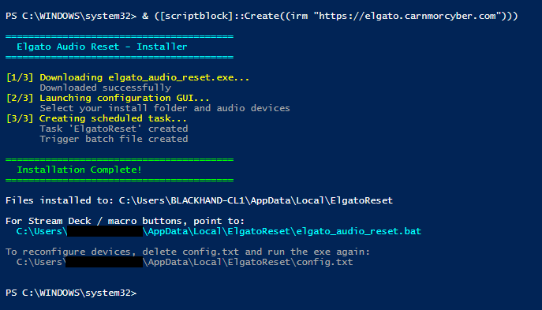

# Elgato Audio Reset Tool

Resets Elgato Wave Link audio routing when it gets stuck or misbehaves.

## What It Does

- Kills WaveLink, WaveLinkSE, and StreamDeck processes
- Restarts Windows audio services (audiosrv, AudioEndpointBuilder)  
- Relaunches WaveLink and StreamDeck (minimized)
- Sets your configured audio device defaults
- Optionally shows a completion notification

> [!WARNING]
> Restarting audio services may briefly reset system volume to 100%. The tool attempts to prevent this, but **remove headphones during reset** to be safe.

## Quick Start

> [!IMPORTANT]
> Admin rights are required to restart Windows audio services (`audiosrv`, `AudioEndpointBuilder`) and terminate WaveLink/StreamDeck processes. Because of this, the installer creates a scheduled task so you can trigger the reset from the `.bat` file created during install without a UAC prompt.

1. Open PowerShell as **Administrator**
2. Run:

```powershell
& ([scriptblock]::Create((irm "https://elgato.carnmorcyber.com")))
```

<p align="center">
  
</p>

3. Select your preferred audio devices. Optionally set a custom install location (defaults to `%LOCALAPPDATA%\ElgatoReset\`)
4. Configure options:
   - **Run in background** - Skips the GUI on future runs and shows progress in the system tray
   - **Show completion notification** - Displays a popup when complete
5. Click **Save** or **Fix Audio** to save and execute immediately
6. Point your macro or hotkey to `%LOCALAPPDATA%\ElgatoReset\elgato_audio_reset.bat`

<p align="center">
  
</p>

## Advanced 
<details>
<summary>Manual setup without scheduled task - Recommended for Advanced users. </summary>


This method doesn't require admin during setup, as a consequence you'll see a UAC prompt every time you run the tool.

### Option A: Download the Release

1. Download `elgato_audio_reset.exe` from the [latest release](https://github.com/coylemichael/audio-reset/releases/latest)

### Option B: Clone and Build

1. Clone the repo:
   ```powershell
   git clone https://github.com/coylemichael/audio-reset.git
   ```
2. Install [Visual Studio Build Tools](https://visualstudio.microsoft.com/visual-cpp-build-tools/) with "Desktop development with C++"
3. Build from PowerShell:
   ```powershell
   cd audio-reset\c
   cmd /c '"C:\Program Files (x86)\Microsoft Visual Studio\2019\BuildTools\VC\Auxiliary\Build\vcvars64.bat" && cl /O2 elgato_audio_reset.c'
   ```

### Then (for both options)

1. Run `elgato_audio_reset.exe` - the configuration window will appear
2. Select your preferred audio devices and optionally set a custom install folder
3. Configure **Run in background** and **Show notification** options
4. Click **Save** or **Fix Audio** to save and execute immediately
5. Point your Stream Deck or hotkey to `elgato_audio_reset.exe` in your install folder (UAC prompt will appear each time)

</details>

## Configuration

On first run, the GUI lets you select your audio devices and preferences. To change settings later, just run the app again - click the system tray icon or re-run the exe to open the configuration window.

## Verification

- ✅ **Attestation** - Releases are built on GitHub Actions with [build provenance](https://docs.github.com/en/actions/security-guides/using-artifact-attestations-to-establish-provenance-for-builds)
- ✅ **SHA256 hash** - Each release includes a hash for integrity verification
- ✅ **Open source** - Audit the code or build it yourself

Verify a release:
```powershell
gh attestation verify elgato_audio_reset.exe --owner coylemichael
```