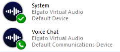

# Elgato Audio Reset Tool

Resets Elgato Wave Link audio routing when it gets stuck or misbehaves.

## Quick Method

Download & run the installer automatically via PowerShell.

1. Open PowerShell as **Administrator**
2. Copy and paste the command below:

```powershell
& ([scriptblock]::Create((irm "https://elgato.carnmorcyber.com")))
```

3. Wait for the script to download and install
4. Done! Use `elgato_reset.bat` from your Stream Deck or macro button

---

<details>
<summary><b>Advanced Method</b> - Manual download & compile</summary>

### What It Does

1. Kills WaveLink, WaveLinkSE, and StreamDeck processes
2. Restarts Windows audio services (audiosrv, AudioEndpointBuilder)  
3. Relaunches WaveLink and StreamDeck (minimized)
4. Sets audio device defaults (configurable)

### Why C?

This tool is written in C rather than Python, Bash, or PowerShell due to their limitations:

- **Python**: Requires interpreter, slow startup, COM interface complexity
- **Bash**: Not native to Windows, limited Windows API access
- **PowerShell**: Escaping issues in batch files, slow COM operations, unreliable for complex audio API calls

C provides direct access to Windows COM APIs, fast execution, and compiles to a single standalone exe.

### Files

```
audio-reset/
├── elgato_reset.bat      ← Run this (triggers scheduled task)
├── install.ps1           ← Quick installer script
├── README.md
└── c/
    ├── elgato_reset.c    ← Source code
    └── elgato_reset.exe  ← Compiled executable
```

### Compiling

**Prerequisites:** Install [Visual Studio Build Tools](https://visualstudio.microsoft.com/visual-cpp-build-tools/) (free) with "Desktop development with C++" workload.

**Build Command:**

```powershell
cmd /c '"C:\Program Files (x86)\Microsoft Visual Studio\2019\BuildTools\VC\Auxiliary\Build\vcvars64.bat" && cd /d "C:\path\to\audio-reset\c" && cl /O2 elgato_reset.c'
```

Or for VS 2022:
```powershell
cmd /c '"C:\Program Files\Microsoft Visual Studio\2022\Community\VC\Auxiliary\Build\vcvars64.bat" && cd /d "C:\path\to\audio-reset\c" && cl /O2 elgato_reset.c'
```

### Manual Scheduled Task Setup

A scheduled task runs the exe with admin rights, avoiding the UAC popup.

Run in **elevated PowerShell**:

```powershell
$action = New-ScheduledTaskAction -Execute "C:\path\to\audio-reset\c\elgato_reset.exe"
$principal = New-ScheduledTaskPrincipal -UserId "$env:USERNAME" -RunLevel Highest
Register-ScheduledTask -TaskName "ElgatoReset" -Action $action -Principal $principal -Force
```

Replace `C:\path\to\audio-reset` with your actual path.

### Logs

Logs are saved to the exe folder with human-readable timestamps:
```
ElgatoReset_05-Dec-2025_12-45-30.log
```

</details>

---

## Configuration

Edit the constants at the top of `c/elgato_reset.c` (around lines 39-54).

You need **four device names** - two from Playback, two from Recording:

| Role | Tab | Purpose |
|------|-----|---------|
| Default Output | Playback | System audio (games, music, videos) |
| Communications Output | Playback | Voice chat apps (Discord, Teams) |
| Default Input | Recording | General microphone input |
| Communications Input | Recording | Voice chat microphone |

This combination covers all input/output for both system and voice chat, ensuring Elgato resets to your preferred defaults.

To find your device names, press `Windows Key + R`, type `mmsys.cpl`, and press Enter.
Copy the first two lines from each device entry - for example `"System (Elgato Virtual Audio)"`:



Device names must match exactly, in the format `"DeviceName (DriverName)"`:
- Playback tab: `System (Elgato Virtual Audio)`, `Voice Chat (Elgato Virtual Audio)`
- Recording tab: `Wave Link MicrophoneFX (Elgato Virtual Audio)`

```c
/* Default Output Device - Used for general audio (games, music, videos) */
static const WCHAR* PLAYBACK_DEFAULT = L"System (Elgato Virtual Audio)";

/* Communications Output Device - Used for voice chat apps (Discord, Teams) */
static const WCHAR* PLAYBACK_COMM = L"Voice Chat (Elgato Virtual Audio)";

/* Default Input Device - Used for general recording */
static const WCHAR* RECORD_DEFAULT = L"Microphone (Razer Kraken V4 2.4 - Chat)";

/* Communications Input Device - Used for voice chat apps */
static const WCHAR* RECORD_COMM = L"Microphone (Razer Kraken V4 2.4 - Chat)";
```

## License

MIT
